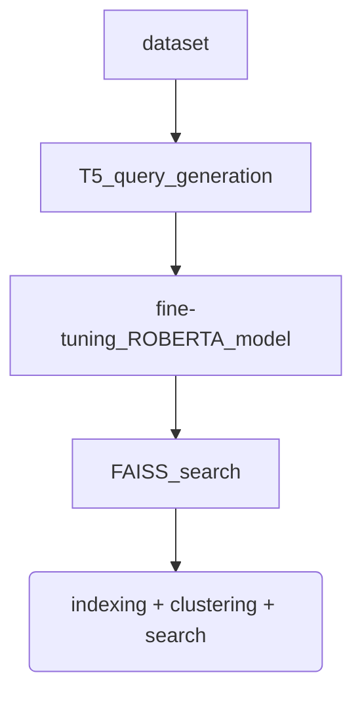

 # ROBERTA + FAISS Semantic Search

This is a semantic search implementation combining Roberta + T5 + FAISS





### Running the app locally

First, clone the git repo, then create a virtual environment for installing dependencies.
Feel free to use conda or any other environment manager of your choice.

```
git clone https://github.com/amrohendawi/roberta-t5-faiss-semantic-search.git
cd roberta-t5-faiss-semantic-search
python -m venv venv
```

Activate the environment and install the requirements with pip

```
source venv/bin/activate
pip install -r requirements.txt
```

Run the app

```
python app.py
```

### Working on the implementation

Before you push to heroku make sure to update the dependencies in the requirements.txt file in case of new additions.
Heroku will automatically deploy the latest version of the app after every commit to the master branch.

```bash
pip freeze > requirements.txt
```

## Built With

- [Dash](https://dash.plot.ly/) - Main server and interactive components
- [Dash Bootstrap Components](https://dash-bootstrap-components.opensource.faculty.ai/) - Simplifies the creation of UI components
- [Dash Mantine Components](https://www.dash-mantine-components.com/) - Similar to Bootstrap components but with a different style and more options
- [EN/DE ROBERTA transformer model](https://huggingface.co/T-Systems-onsite/cross-en-de-roberta-sentence-transformer) - A German-English transformer model
- [FAISS efficient similarity search and clustering](https://github.com/facebookresearch/faiss) - An efficient similarity search and clustering library from Facebook
- [T5 Transformer fine-tuned for Synthetic Query Generation](https://huggingface.co/BeIR/query-gen-msmarco-t5-large-v1) - A fine-tuned T5 model for synthetic query generation


## Heroku DevOps

You can push the project to production by simply creating a new app on heroku and connecting it to your github repo within 60 seconds.
